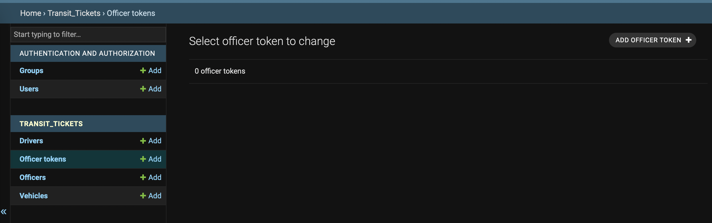
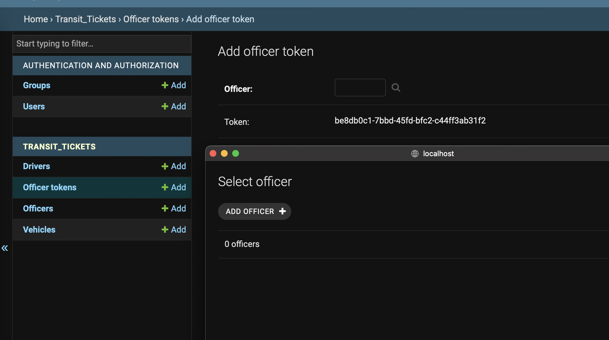
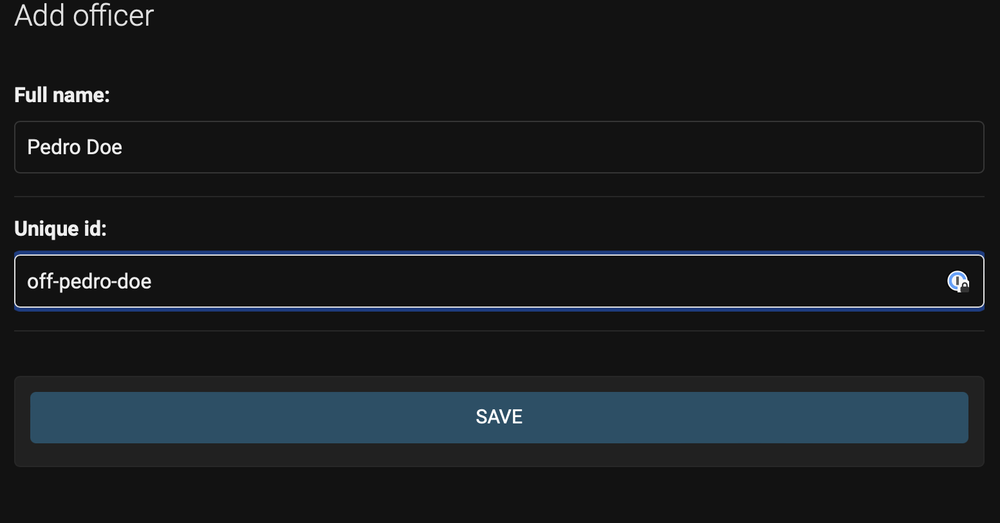
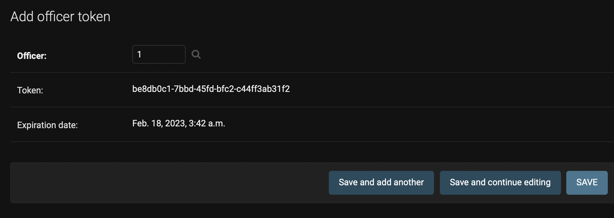
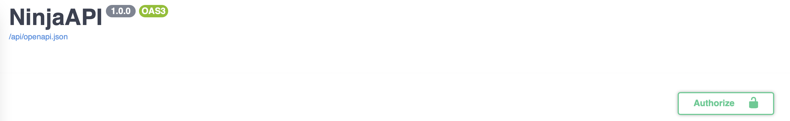
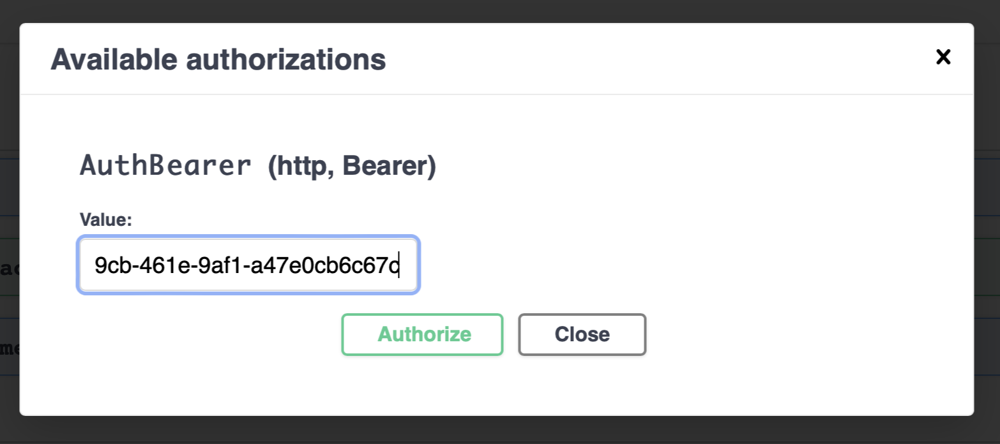

# N5 assessment:

Aplicacion para el control de infracciones de transito


## Caracteristicas:

- Aplicacion con Django y Django Ninja
- Para la configuracion de los secretos se usa Django-environ y se puede configurar tanto como por variables de entorno como archivos .env
- La aplicacion lleva pruebas funcionales que solo cubren el happy path.
- Se usa mayormente docker-compose para el desarrollo, pero se puede levantar la imagen de docker sola (hace falta que apunte a una configuracion de BD)
- la API mantiene una documentacion por separado OpenAPI 3 compatible.
- Se usaron buenas practicas con docker (layer caching, wait for DB, etc.)


## Uso con Docker / Docker-compose:

Para poder ejecutar el sistema completo (aplicación y base de datos) puedes clonar el repositorio y ejecutar:


```shell
docker-compose up 
```

Una vez haya iniciado puedes ir a 
- http://localhost:8000/admin para ver la pagina de administración (ver la sección de administración)
- http://localhost:8000/api/docs para ver la documentación de la api (ver la sección de la API)


## Manejo del sistema: Administrador

Para poder ingresar al sistema como administrador se necesita una contraseña de super usuario, la podemos generar directamente con docker:

```shell
docker-compose run app python manage.py createsuperuser --username <username> --email <email>
```

Nota: reemplazar los campos `<username>` y `<email>` con el usuario y correo que se desee


Luego de esto preguntara por una contraseña que le debemos de proveer y tendremos el usuario creado podemos ahora iniciar el servidor con un `docker-compose up` y en http://localhost:8000/admin podremos autenticarnos con el usuario y contraseña creados.


## Manejo del sistema: API

Para acceder a la api podemos hacer llamadas directamente a http://localhost:8000/api inicialmente nos data un status de que todo esta ok

La documentacion de toda la API la podemos encontar directamente en http://localhost:8000/api/docs esta en formato OpenAPI por lo que sera mas facil importar a otras herramientas como Postman.

Dentro de la documentación se pueden probar los endpoint, ya que el endpoint de cargar información es autenticado, hara falta crear un token de usuario.


###  Creación de un token de usuario:

Para poder tener un token tenemos que generarlo desde el administrador.

Dentro del admin, vamos al panel de **Officer Tokens**:



Dentro del panel le damos en add officer token, y en la ventana que sale buscamos con la lupa el oficial encargado. De no existir dicho oficial lo podemos crear directamente desde la misma ventana.





Luego de ello en la ventana de token aparecera un nuevo token aleatorio, copiamos el codigo del token y le damos en **save**



y podemos usar ese token para las consultas en la api.

para poder authenticarnos y hacer las pruebas podemos enviar una llamada con el header de **"Authorization": "Bearer <token>"** aunque para probar en la pagina de la documentación podemos ingresar el token directamente en la sección de **Authorize**
que esta ubicada en la parte superior derecha:



Y en la ventana que aparece colocar *solo el token* para luego darle al boton de **Authorize** y luego cerrar la ventana:



## Requerimientos de desarrollo

Para ejecutar la aplicación de desarrollo necesitas:

- Python 3.8+
- poetry (puede funcionar con virtualenv pero recomiendo poetry)
- Una base de datos: por defecto usa una base de datos sqlite (alojado en un archivo llamado app.db) pero el servidor en docker utiliza por defecto una base de datos en PostgreSQL

### Configuración de la base de datos:

#### Para uso local:
Para poder configurar la base de datos tenemos dos opciones:

- Podemos configuar con una variable de entorno llamada **`DATABASE_URL`**
- Podemos crear un archivo de entorno llamado `.env` que configura esta variable. por ejemplo:

```shell
DATABASE_URL="postgres://user:pass@db:5432/assessment_db"
```

#### Para uso en Docker / Docker compose:

para usar en docker podemos para esta variable por entorno usando el parametro `-e`

```shell
docker run -e DATABASE_URL="postgres://user:pass@db:5432/assessment_db" soloidx/n5_assessment
```

En el caso de docker-compose, la variable de entorno ya se encuentra configurada, junto a una base de datos y esta ubicada en ./docker/docker.env

La configuración por defecto de la base de datos es:

Usuario: `n5_pg_user`

Contraseña: `n5_pg_pass`

Base de datos: `assessment_db`


**Nota**: por temas de seguridad el puerto de la base de datos no esta expuesto publicamente, se puede descomentar esa seccion en caso se deseee en el archivo de `docker-compose.yml`

### Testing de la API

Para poder correr las pruebas se puede optar por estos dos escenarios:

- las pruebas locales se pueden correr con `python manage.py test`
- las pruebas con docker se pueden correr con `docker-compose run app python manage.py test`

## Deployment en AWS:

Para un supuesto deployment en AWS se han considerado las posibles alternativas:

### Base de datos:

Considerando que lo que normalmente se necesita es una base de datos relacional, se puede:
- levantar una instancia de Amazon RDS.
- gestionar una instancia de PostgreSQL o MySQL en EC2 con un balanceo de carga.

considerando los costos y el equipo de trabajo necesario la mejor opción para estos casos seria **Amazon RDS**

### Aplicación:
Ya que se usa normalmente Docker para la aplicación se pueden considerar estas opciones:
- Levantar una instancia de Amazon Fargate
- Levantar una instancia de Amazon ECS
- Levantar una instancia de Amazon EKS
- Levantar todo en una instancia de EC2

De entre todas esas opciones la mas adecuada (considerando la carga y complejidad de la aplicación) seria usar Amazon Fargate:
- Es simple de mantener y escalar bajo demanda, los costos son mas adecuados al uso
- Se evita la configuracion extra de los auto scaling groups y la monitorización.
- Se evita la complejidad de manejar un cluster de Kubernetes
- Se cobra solo por el uso en el tiempo de ejecución

considerando estas dos opciones la solución seria:

- Crear un VPC para la comunicación interna entre la app y la BD
- Configurar la BD usando Amazon RDS
- Subir la app hacia una instancia de Amazon fargate
- Configurar las variables de conexion dentro de la tarea de fargate como variables de entorno

Y en el caso de necesitarse un acceso publico:

- Configurar el DNS usando Amazon Route 53 
- Levantar un Application Load Balancer que apunte el dominio a la(s) instancia(s) de fargate


